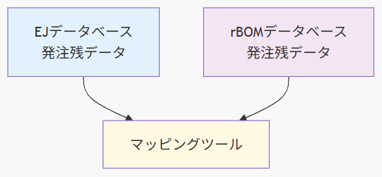

# EJ-rBOM マッピングツールについて

7月25日のお打合せより

---

# 📋 簡単に整理します

1. **移行期の課題**
2. **マッピングツールとは**
3. **3つの主要機能**
5. **お聞きしたいこと（データについて）**

---

# 🔄 移行期の課題

## 2つのシステム

- **現行**: EJ（生産管理システム）
- **新規**: rBOM（12月稼働予定）

## タイミングのずれ

```
11月30日まで → EJで発注
12月1日以降 → rBOMで実績登録
```

**⚠️ 問題**: 11月までにEJで発注した商品を、12月以降にrBOMで受け入れる

---

# 🤔 なぜ問題なのか？

## 同じ発注でも伝票番号が異なる

| | EJ | rBOM |
|---|---|---|
| 発注番号 | E2024110001 | RB00001+002 |
| 品目 | 部品ABC | 部品ABC |
| 数量 | 100個 | 100個 |

**これらが同じ発注であることを判断する仕組みが必要**

---

# マッピングツールとは

## 基本的な役割

**EJの発注番号 ⟷ rBOMの発注番号を紐づける**

## 特徴

-  **使用期間**: 2～3ヶ月の一時利用
-  **対象**: 12月1日以降納品の発注残

---

# 機能1：自動マッピング

## 仕組み
- 品目番号と発注数量の一致で判断
- 複数候補→納期の近いものを優先

## 処理イメージ

```
【マッピング前】
EJ:   品目ABC × 100個 → 発注番号？？？
rBOM: 品目ABC × 100個 → 発注番号？？？

【マッピング後】
EJ発注番号2024110001 ⟷ rBOM発注番号RB00001+002
```

---

# 機能2：手動マッピング

## 自動でできない場合の補助機能

### 想定ケース
- 数量に若干の差異
- 特殊な事情がある発注

※品目コードのずれは無い想定

**担当者が画面で確認しながら選択**

---

# 📱 機能3：i-Reporter連携（検討中）

## 現場での実績登録を効率化

### 動作イメージ
1. 📷 現品票のバーコード読み取り（EJ番号）
2. 🔍 マッピング情報から対応するrBOM番号を取得
3. ✅ rBOMシステムに実績を自動登録

<br>

**❓ この機能が本当に必要かご意見をお聞かせください**

---


# ご質問（1/2）

## 1. ツールの基本仕様の確認

**3つの機能で方向性は正しいでしょうか**

（※まずは概要レベルで）

---

# ご質問(2/2）


## 📊 確認したいデータの流れ





両システムから発注残データを取得し、紐づけを実施
**⇒この両システムの抽出条件を確認したいです**　（回答は後日でOKです）


---

## EJシステムから
- どのテーブルから発注残データを取得？
- マッピング対象の発注残を取得する際の条件（抽出条件）は？

現在は以下のような感じです
```sql
SELECT 
    t.PUCH_ODR_CD as order_no,           -- 発注番号
    t.ITEM_CD as item_code,              -- 品目番号
    m.ITEM_NAME as item_name,            -- 品目名（M_ITEMから取得）
    t.PUCH_ODR_QTY as quantity,          -- 発注数
    t.PUCH_ODR_DLV_DATE as delivery_date,-- 発注納期
FROM EXPJ2.T_RLSD_PUCH_ODR t
LEFT JOIN EXPJ2.M_ITEM m ON t.ITEM_CD = m.ITEM_CD
WHERE t.PUCH_ODR_DLV_DATE >= DATE '2025-07-01'  -- 固定条件　本番は2025-12-01
  AND t.ACPT_CMPLT_DATE IS NULL                 -- 受入完了日が空欄のもののみ
ORDER BY t.PUCH_ODR_CD
```

---

## 現在取得しているデータ

```
T_RLSD_PUCH_ODR（発注残テーブル）　にある
PUCH_ODR_DLV_DATE（カラム名：発注納期）　が指定日以降のデータのうち、
ACPT_CMPLT_DATE（カラム名：受入完了日）　がNULLのデータ（＝発注残）
```

<br>

**条件に不足があるようです**
⇒追加の条件をご教示ください


---

## rBOMシステムから

- どのテーブルからデータを取得？（rBOMは基本的に全て発注残）
- マッピング対象の発注残を取得する際の条件（抽出条件）はありますか？
- 受入完了データ（＝新規マッピング対象外）の見極め条件は？

発注残の取得

```
D3340（発注明細F）　にあるデータ

※もし移行途中のデータが残る場合は、「発注番号」でフィルタリングする。

```

---

## 受入済データ（新たにマッピングしないデータ）の見極め条件

rBOMでの**受入済データ**を新規マッピング対象外とします

### 受入済データ
- EJの発注番号とマッピングされて受入済となったデータ
  ⇒**後からマッピングを変更するとずれる**ため対象外
- EJの発注番号とマッピングされずに受入済となったデータ
  ⇒**rBOMから発注されたデータ**のため対象外

---

## rBOMで受入済とするデータ

```
D3340（発注明細F）　にあるデータのうち、
  STATUS（状態）が3(一部完納),4(完納),8(強制完納),9(中止)のデータ

＋

DK020（i-Reporter受入F）　にあるデータのうち
　SYORIZUMIKB（処理済区分）が1（未）のデータ
　※ 2(済)はD3340のSTATUSも更新されるという認識でOKですか？
```

<br>

⇒見落としがありますでしょうか