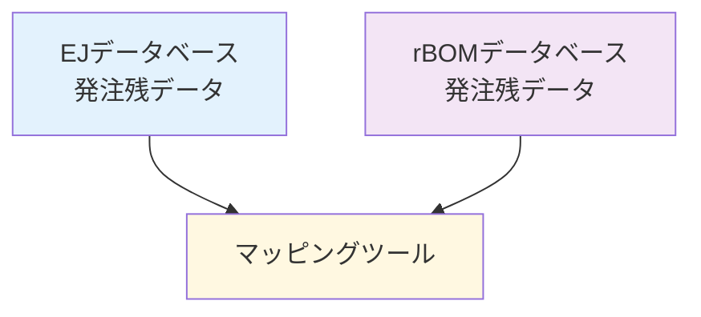

# EJ-rBOM マッピングツールについて

## 概要

### 移行期の課題

- **現行システム**: EJ（～11月30日）
- **新システム**: rBOM（12月1日～）

12月の移行時に、以下のような状況が発生します：

```
11月30日まで → EJで発注
12月1日以降 → rBOMで受入実績登録
```

**問題点**: 11月にEJで発注した商品を、12月にrBOMで受け入れる必要があります。

しかし、同じ発注でも両システムで伝票番号が異なります。

### 具体例

```
【EJでの発注】          【rBOMでの発注】
発注番号: 2024110001    発注番号: RB00001
品目: ABC-50122022           品目: ABC-50122022
数量: 100個             数量: 100個
```

これらが同じ発注であることを、システムが自動的に判断する仕組みが必要です。

## 2. マッピングツールとは

### 基本的な役割

EJの発注番号とrBOMの発注番号を「紐づける」ツールです。

- **使用期間**: 移行後2～3ヶ月程度の一時的な利用
- **対象データ**: 12月1日以降に納品される発注残

## 3. 主要な3つの機能

### 機能1：自動マッピング

**仕組み**
- 品目番号と発注数量が一致するものを自動で紐づけ
- 複数候補がある場合は、納期の近いものを優先

**イメージ**
```
マッピング前：
EJ:   品目ABC × 100個 → 発注番号？？？
rBOM: 品目ABC × 100個 → 発注番号？？？

マッピング後：
EJ発注番号2024110001 ⟷ rBOM発注番号RB00001+002
```

### 機能2：手動マッピング

自動でマッピングできなかった場合の補助機能です。

**想定されるケース**
- 数量に若干の差異がある場合
- その他、特殊な事情がある発注

※品目コードのずれは無い想定です

担当者が画面上で確認しながら、正しい組み合わせを選択します。

### 機能3：i-Reporter連携（検討中）

実績登録にi-Reporterを使用するのであれば

**動作イメージ**
1. 現品票のバーコード（EJ番号）を読み取る
2. マッピング情報から対応するrBOM番号を取得
3. rBOMシステムに実績を自動登録

※この機能が本当に必要かどうか、ご意見をお聞かせください。

## 4. データの流れ（概要）



両システムから発注残データを取得し、マッピングツールで紐づけを行います。

## 5. 本日決めたいこと

### 1. ツールの基本仕様の確認
- 上記3つの機能で方向性は正しいでしょうか

（まずは概要レベルで）

### 2. データ取得方法について

**EJシステムから**
- どのテーブルから発注残データを取得すればよいか
- 取得する際の条件（抽出条件）は何か

**rBOMシステムから**
- どのテーブルから発注残データを取得すればよいか
- 取得する際の条件（抽出条件）は何か

