

# 編機調整報告書  

## i-Reporter操作マニュアル

 
 
 
2025年4月21日  

---

## 編機調整報告書が紙から**iPad**に変わります

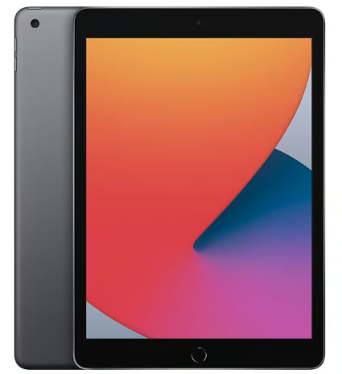

---

## レイアウトは紙の編機調整報告書を引き継いでいます

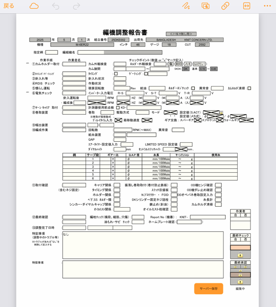

---

# 使い方：iPadへのログイン

---

## iPadへのログインは端末番号で行います（小文字4桁＋数字2桁）

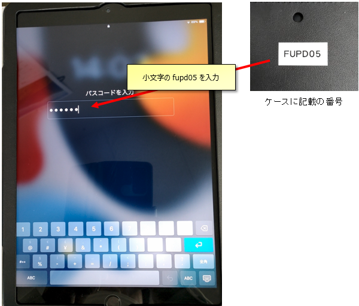

---

### ※稀に「パスワード入力」時に入力用のキーボードが表示されないことがあります。その場合は、タブレット右上の電源ボタンを押下して画面を一旦暗くし、その後再度電源ボタンを押してから入力してください

 

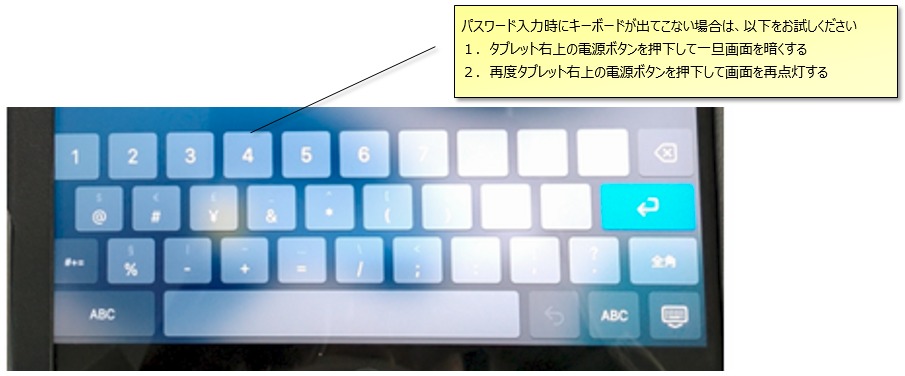

---

# 使い方：編機調整報告書の立上げ

---

## iPad運用が始まると、QRコード付きの用紙が機械に貼られます

## このQRコードをiPadの標準カメラで読み取って下さい

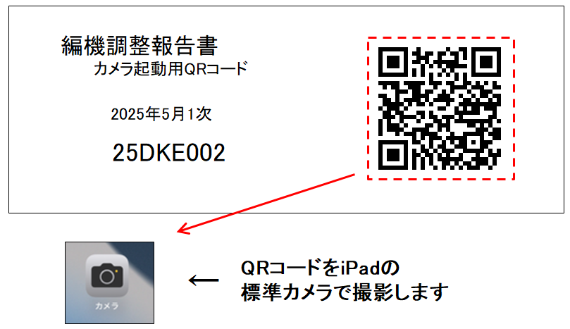

---

### QRコードを読み取ると画面の上部に通知が出るのでこの通知をタップします

### ユーザーID：**pfw01**　パスワード：**pass01**　と入力します

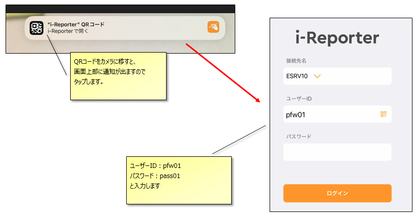

---

### 目的の編機調整報告書が立ち上がるので、チェックを開始してください

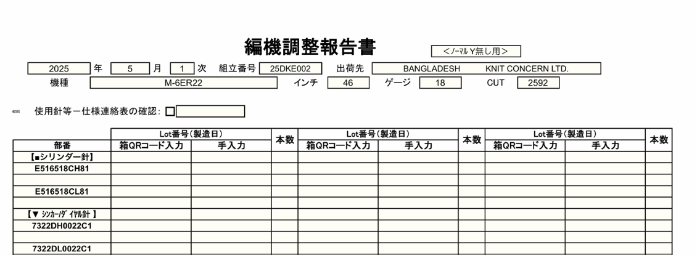

---

# 使い方：運用の注意点とお願い

---

## ①１ページ目は針並べ、２ページ目以降は調整作業の入力欄です

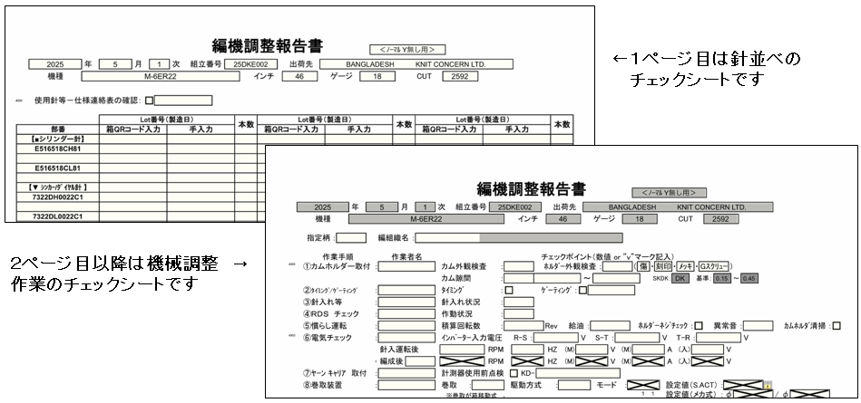

---

### ②作業中断時は2ページ目の右下「サーバー保存」を押下してください

### 中断後は再度QRコードを読み取ることで再開できます

 

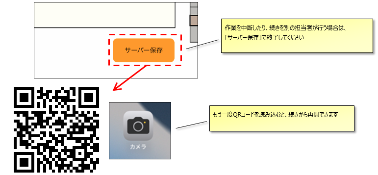

---

### 注意：一つの編機調整報告書を同時に開いて別々のチェックを行うと、後から「サーバー保存」した方が優先されるのでご注意ください

 

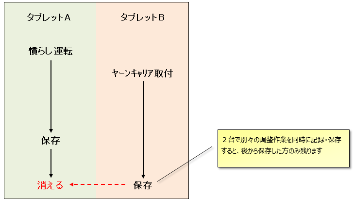

---

## ③作業者名は該当の調整作業の**完了後**に、入力してください

### ※名前の入力と同時に保存処理が行われ、作業完了の実績が更新されます

 

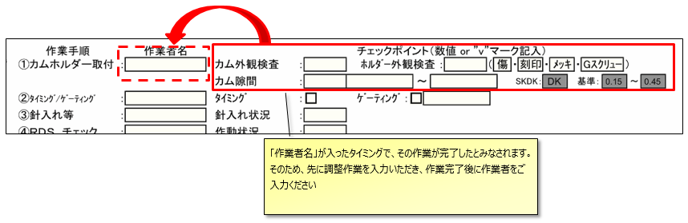

---

## 参考：作業実績確認画面

### ※作業の都合で順番が前後しても問題有りません

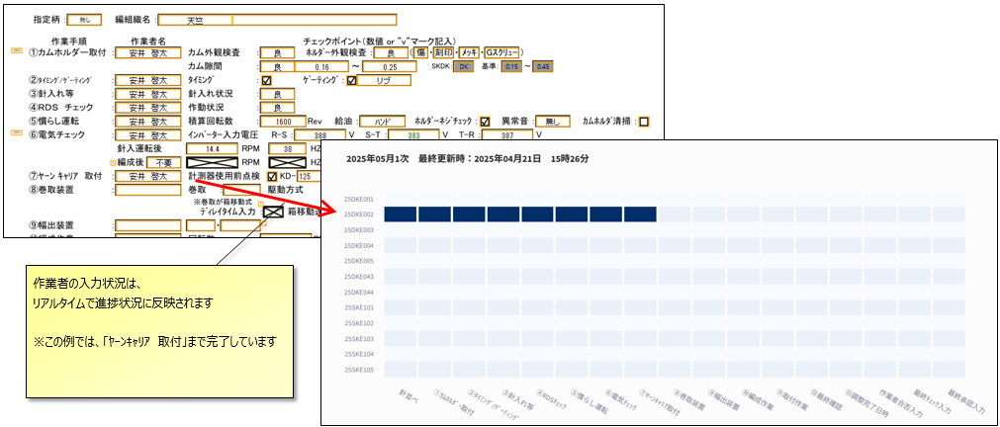

---

### ④作業者名は初期値がニット課の社員となっています（「電気ﾁｪｯｸ」以外）

 
 

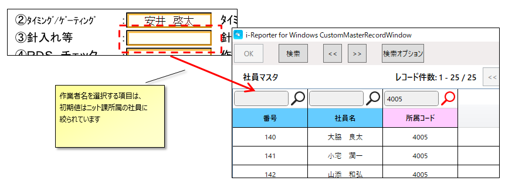

---

### 作業者名をニット課以外から選択する場合は、

### 所属コードを空欄にして「検索」ボタンを押下してください

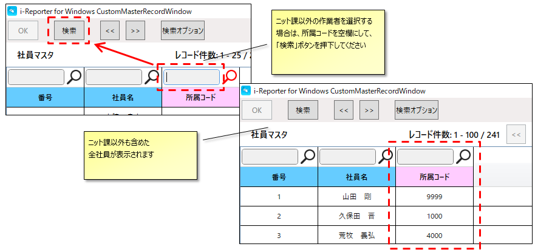

---

### ⑤最終の作業者チェックが終わると、承認申請画面が立ち上がります

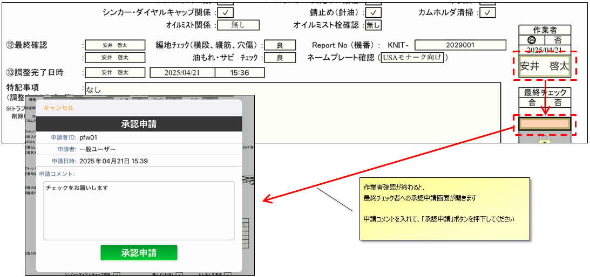

---

## 「承認申請」を押下した際、入力漏れがあると引っかかります

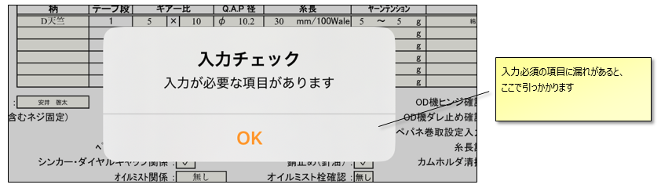

---

### チェック漏れを解消し、再度承認申請を行ってください

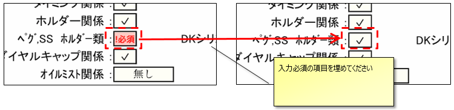

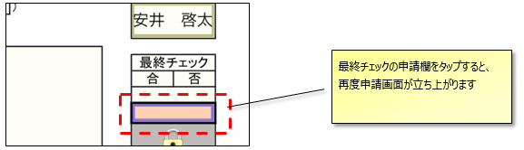

---

## 承認欄が緑のマークになれば申請完了です

### ※承認権限はGL以上が持っていますので、直接声を掛けるか、電話で連絡して最終チェックを依頼するようお願いいたします

 
 

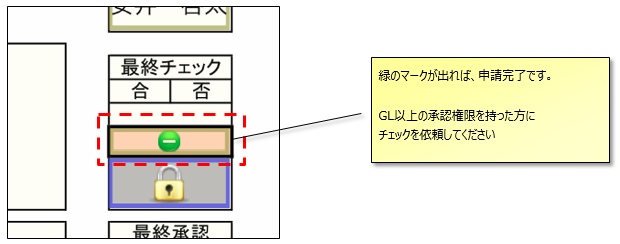

---

### 参考：承認待ち状態の進捗状況確認画面

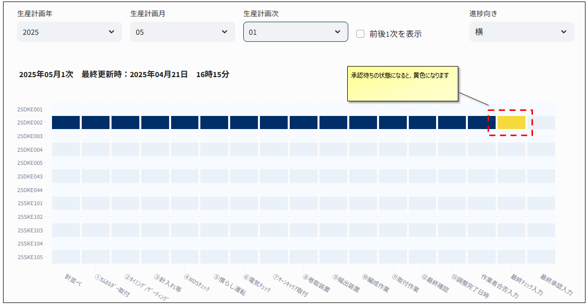

---

## ⑥電柄機、Y付、ｾﾐｼﾞｬｶﾞｰﾄﾞ機のいずれかに該当する場合は3ページ目以降が存在します

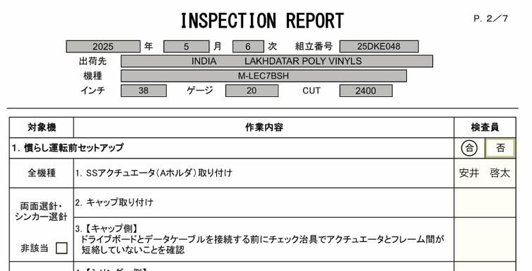

---

### 入力不要の項目は、「非該当」にチェックを入れてください

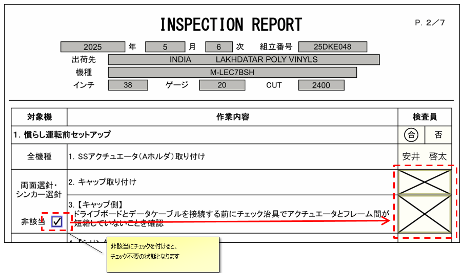  

---

# 以上です

## ありがとうございました

