# 操作マニュアル

当ドキュメントは、編機調整報告書発行システムの操作マニュアルです。

 

## 当マニュアルについて

当マニュアルは画面左のマニュアルをクリックすると最新のものが表示されます。  
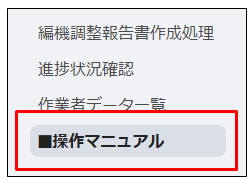

 

印刷する場合は、画面右上の「･･･」から「Print」をご選択ください。  
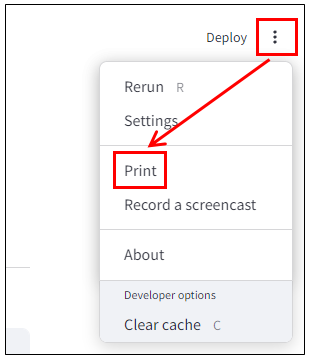  

 

## 画面：編機調整報告書作成処理

### 概要  

編機調整報告書をi-Reporterに作成する画面です。  
この画面で帳票作成処理を行うと、対象月のi-Reporterでの調整報告書の記入作業を開始可能となります。

### システムのご利用方法

[http://ESRV10:8501/](http://ESRV10:8501/) へアクセスするとご利用を開始できます。  
MicrosoftEdge、またはGoogleChromeにてアクセスしてください。  
※パスワード等の認証はありません。

### 画面  

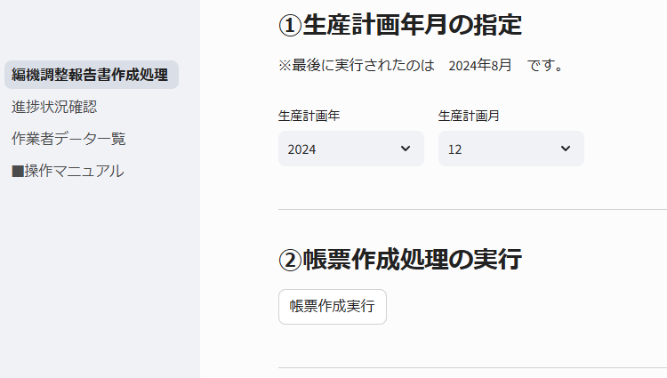

※[http://ESRV10:8501/](http://ESRV10:8501/) にアクセスすると最初に表示されるページです。  

### 使い方と画面説明

### 1.帳票作成処理の実行

発行対象年月を選択して、「帳票作成実行」ボタンを押下します。  

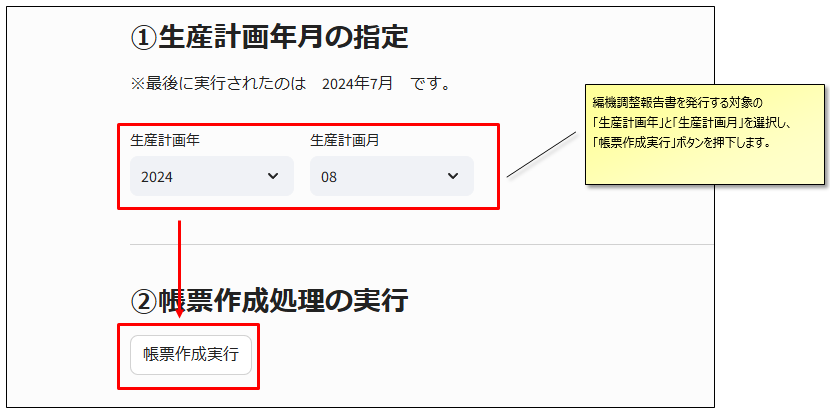

7~10分ほどお待ちいただき、「帳票作成処理完了」のメッセージが出れば処理完了です。  
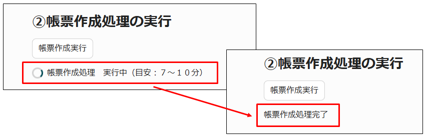  

### 2.i-Pad用のQRコードを発行します

「QRコード作成処理実行」を押下するとQRコードを記載したエクセルファイルが作成されます。  
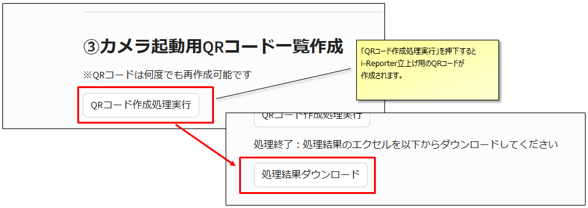

 

「処理結果ダウンロード」ボタンを押下するとエクセルファイルがダウンロードされるので、印刷してご利用ください。  
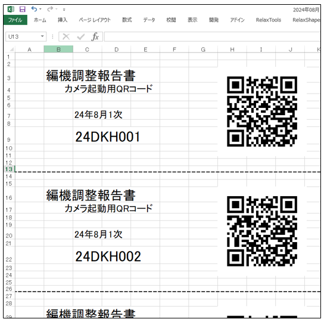  

 

### 3.注意事項

#### ２カ月以上先の生産計画年月の指定は出来ません

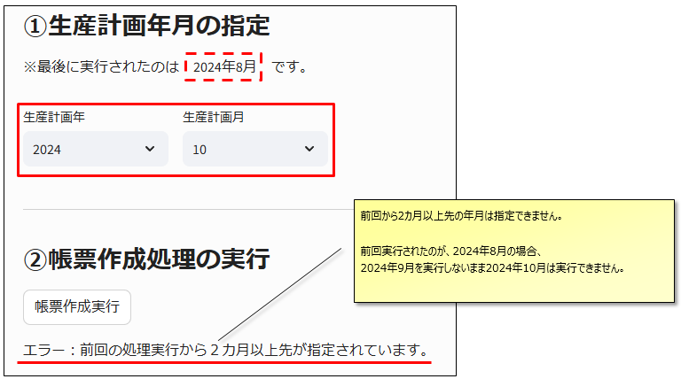

#### 帳票作成済の生産計画年月の指定は出来ません

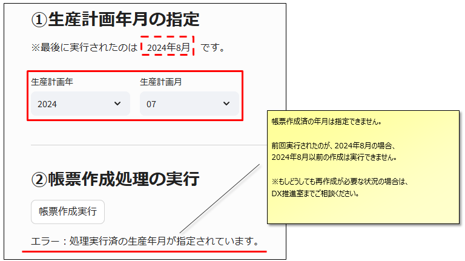

 

#### 帳票作成処理中に処理を中断してしまった場合  

下記処理中に画面を閉じてしまったり、別の画面に移ってしまった場合は、そのまま10分程度お待ちください。
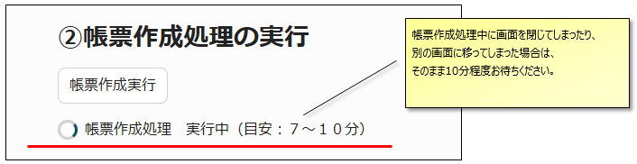  

 

10分後、再度システムにアクセスして「QRコード作成処理実行」のボタンを押下していただき、  
対象月のQRコードが作成できれば帳票作成処理は問題なく完了しています。  
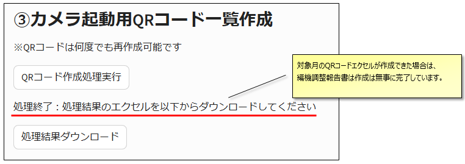  

 

もしデータ無しの表示が出た場合は、帳票作成処理は完了していません。  
再度実行して下さい。  
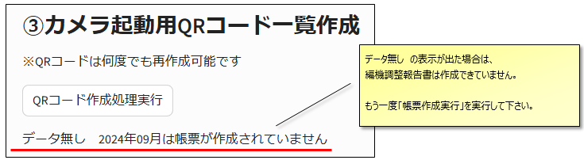

 

## 画面：進捗状況確認

### 概要（進捗状況確認）

編機調整報告書のi-Reporterでの作業実績の入力を収集し、リアルタイムで表示する画面です。  
画面を開きっぱなしの場合も、５分に１度最新データを再取得します。  

画面左側のメニューより、「進捗状況確認」をクリックしてご利用ください。

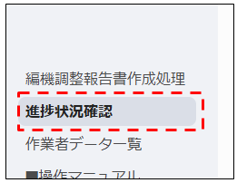

 

### 使い方と画面説明（進捗状況確認）

生産計画年、生産計画月、生産計画次で絞り込み、調整作業の進捗状況を表示します。
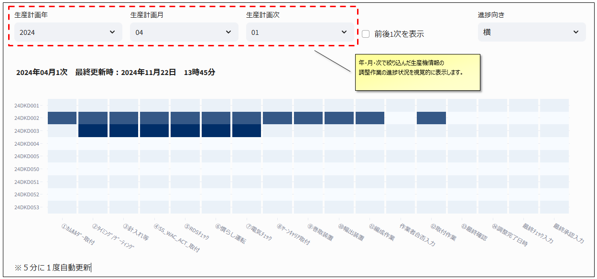  

 
「前後１次を表示」にチェックを入れると、絞り込んだ対象＋前後１次が表示可能です。  

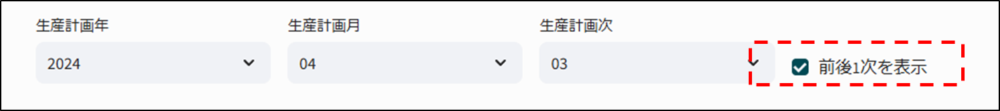  

例）  

- 2024年＋04月＋03次
  - ⇒　2024年4月2次～4次までの3次分が表示されます
- 2024年＋04月＋08次
  - ⇒　2024年4月7次～5月1次までの3次分が表示されます
- 2024年＋04月＋01次
  - ⇒　2024年3月8次～4月2次までの3次分が表示されます
- 2024年＋04月＋未指定（次は空欄）
  - ⇒　2024年3月8次～5月1次までの10次分が表示されます
  

 

「進捗向き」を変更することで縦表示も可能です。  
「生産計画次」を指定しない場合など、表示件数が多いときにご利用ください。  
※省略無しで表示可能な件数はディスプレイの横幅に依存します。

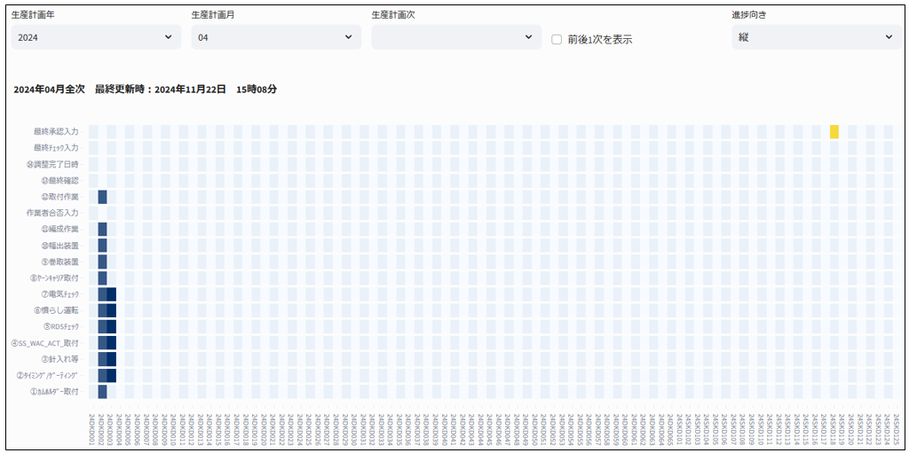

※ご利用のパソコン画面の横幅が狭い場合は表示内容が省略されることがあります。  

 

## 画面：作業者データ一覧

### 概要（作業者データ一覧）

編機調整報告書のi-Reporterでの作業実績の入力者・入力日を一覧表示することが可能です。  
また、表示したデータはcsv形式でのダウンロードも可能です。  
データは、「作業者データ一覧」を表示した時点の最新データを表示します。  
※画面を開きっぱなしの場合、自動更新はされません。

 
画面左側のメニューより、「作業者データ一覧」をクリックしてご利用ください。  

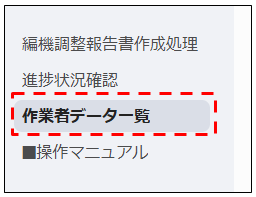

 

### 使い方と画面説明（画面：作業者データ一覧）

生産計画年、生産計画月、生産計画次で絞り込み、各調整作業の作業者と作業完了日を表示します。  

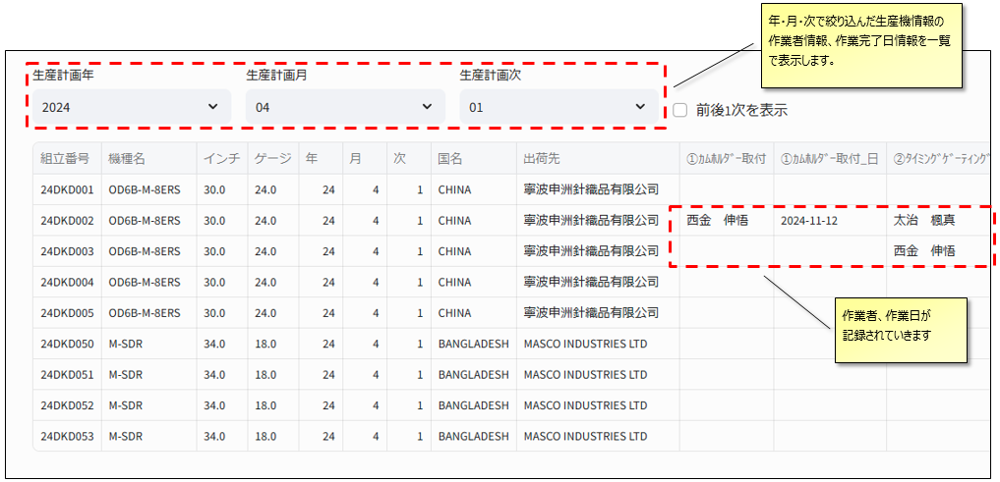  

 
「前後１次を表示」にチェックを入れると、絞り込んだ対象＋前後１次が表示可能です。  

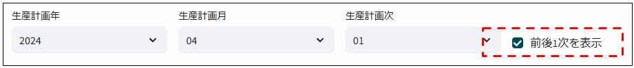

例）  

- 2024年＋04月＋03次
  - ⇒　2024年4月2次～4次までの3次分が表示されます
- 2024年＋04月＋08次
  - ⇒　2024年4月7次～5月1次までの3次分が表示されます
- 2024年＋04月＋01次
  - ⇒　2024年3月8次～4月2次までの3次分が表示されます
- 2024年＋04月＋未指定（次は空欄）
  - ⇒　2024年3月8次～5月1次までの10次分が表示されます
  
 

一覧表は項目ごとの並び替えが可能です。  
（複数同時のソート適用は出来ません）  
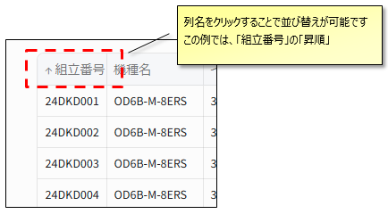  

 

一覧表の右上にカーソルを持ってくると、csvダウンロードや内容の検索が可能です。  
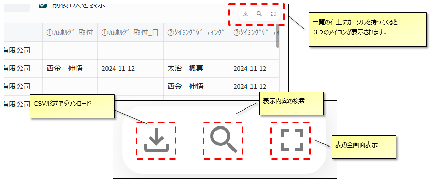

 

「作業者データ一覧」画面は１年分のデータ表示が可能です
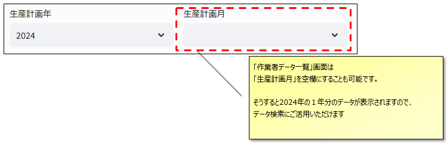  
