# i-Reporterチェック項目入力_操作マニュアル

当ドキュメントは、「i-Reporterチェック項目入力」画面の操作マニュアルです。  

  

---

## 画面概要

i-Reporterのランニングチェックシートで使用するチェック項目の登録を行う画面です。  
この画面から部番に繋がる図番と、図番のVersion毎のチェック内容を登録します。  

※誤更新防止のため、パスワード保護がかかっています。  
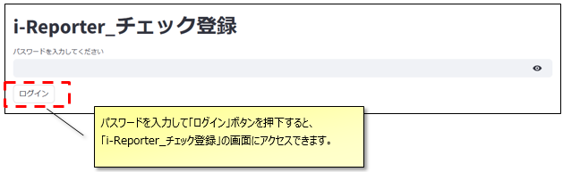  

パスワードによる認証状態は「ログアウト」ボタンを押下するか、  
画面の更新を行うまで維持されます。  
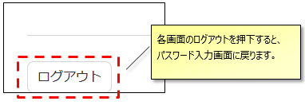

## 画面全体

i-Reporterチェック項目入力は４画面で構成されています。  
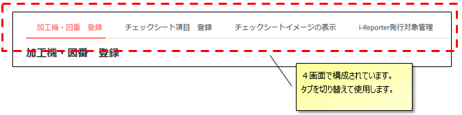  

 

各画面の機能は以下です

- 加工機・図番　登録
  - 完成部番に紐づく図面番号を登録します。
- チェックシート項目　登録
  - 図面と紐づくチェック内容を登録します。
- チェックシートイメージの表示
  - 登録したチェック内容を元に、チェックシートのイメージを確認します。
- i-Reporter発行対象管理
  - i-Reporter管理対象チェックシートの管理画面です。以下の３点を変更できます。
    - i-Reporterでチェックするか紙かの種別を変更
    - QRコードの種類の変更
    - チェックシートを縦にするか横にするかを変更

 

**登録の流れ**  
加工機・図番　登録　画面で図番を登録（必要に応じて加工機も登録）  
⇒　チェック項目登録　画面でチェック項目を登録  
⇒　チェックシートイメージの表示　画面で登録結果を確認  

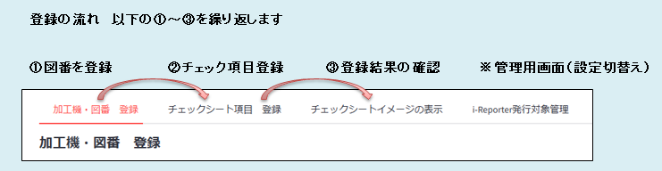  

※i-Reporter発行対象管理　画面主に紙からi-Reporterに切り替える場合、チェックシートの縦横の区分を切り替える場合にのみ使用します。  

## 画面１　加工機・図番　登録

- 上部で抽出条件を入力し一覧表示を絞り込む
- 中部で一覧に入力・登録を実施
- 下部は図番の参考情報

上部・中部  
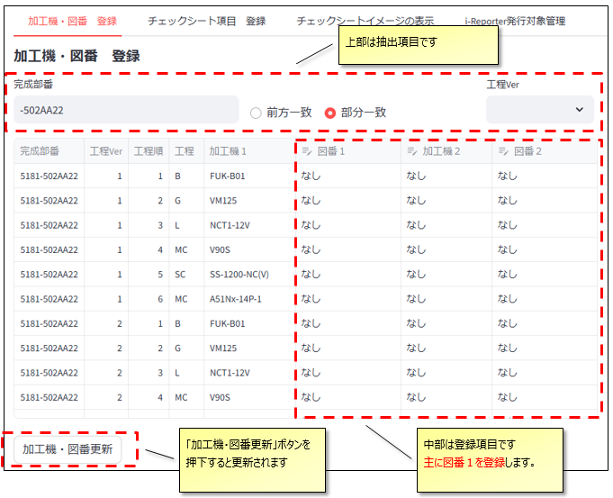  

下部  
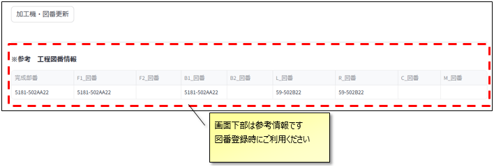

---

## 抽出項目  

中央に表示される一覧画面の表示内容を絞り込みます。  

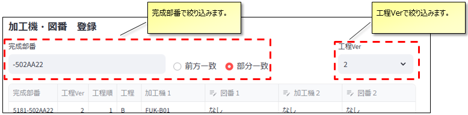  

 

## 入力項目

図番１に対応する図番を入力します。  
図番の設定が無い項目は「なし」のままでもチェック項目を設定することが可能です。  

オイルミスト等で２つ目の加工機・図番を登録する場合は加工機２・図番２をご入力ください。  

入力後「加工機・図番更新」ボタンを押下すると、更新が完了になります。

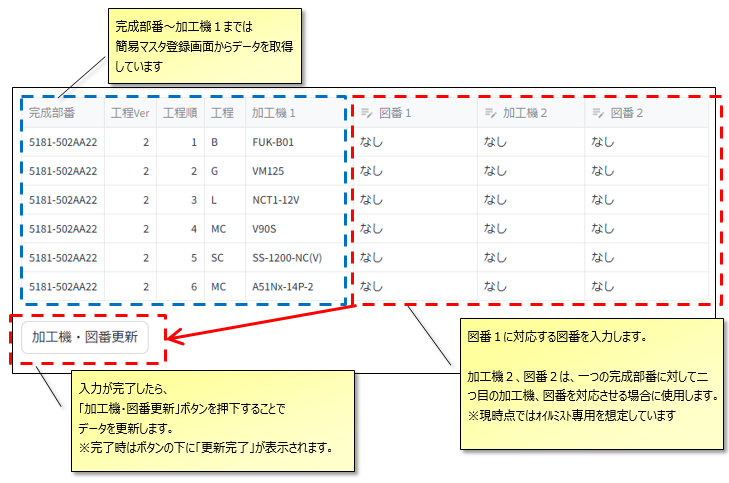  

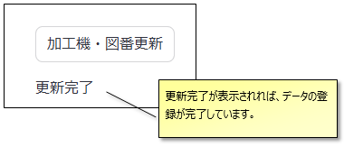  

## 参考情報

画面下部には参考情報として、簡易マスタ入力画面に表示されている図面情報が表示されています。  
コピー＆ペーストで貼り付けてご利用ください。  

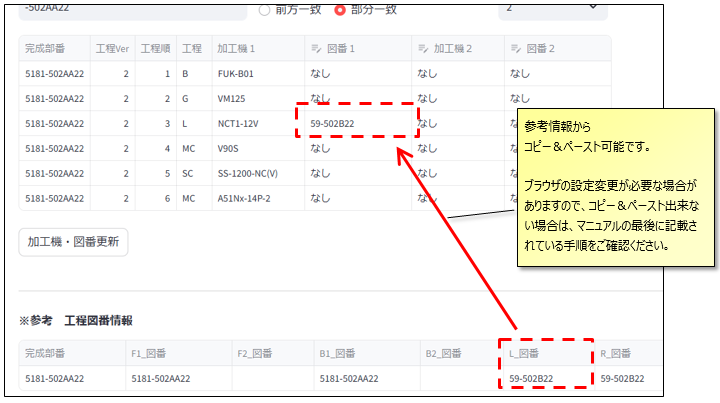  

※コピー＆ペーストを使用するには、ブラウザの設定変更が必要なケースがあります。  
うまくコピー＆ペースト出来ない場合は、マニュアルの最後に記載している「コピー＆ペーストが出来ない場合の設定」の手順を実施ください。

---

## 画面２　チェックシート項目　登録

各工程に紐づく図番毎に、チェック項目を入力して登録します。  

- 上部でチェック項目を入力する図面と図面Verを絞り込みます
- 中部でチェック項目を入力します
- 下部の更新ボタンで登録します

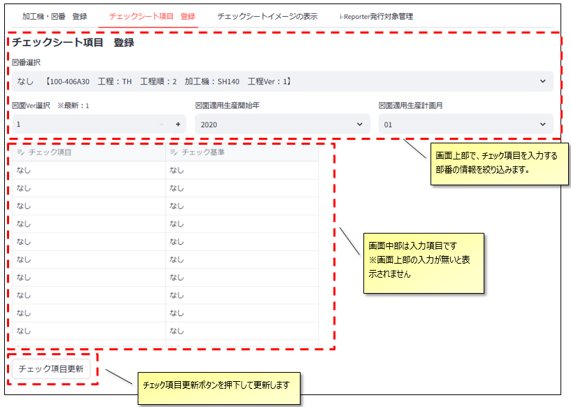

### 図番選択

入力する図番をプルダウンで選択します  
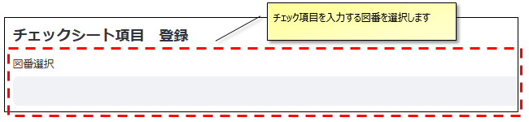  

 

プルダウンで選択可能となるのは、「加工機・図番　登録」画面で表示されている一覧の情報です。  
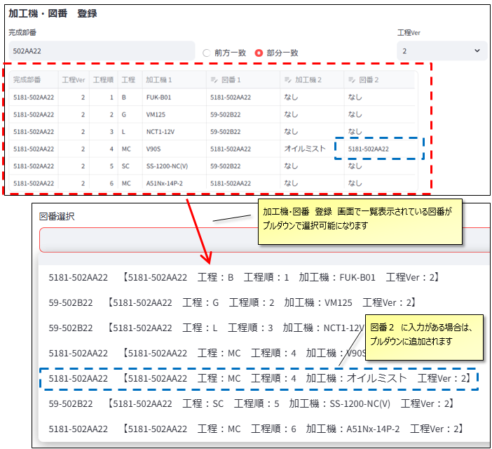  

### 図面Ver、適用開始 年 月 の入力

図面Verと適用開始年月を入力します。　※３項目とも入力必須です。  
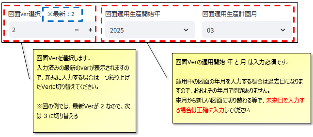

 

### チェック項目の入力

チェックリストの項目を入力する欄です。  
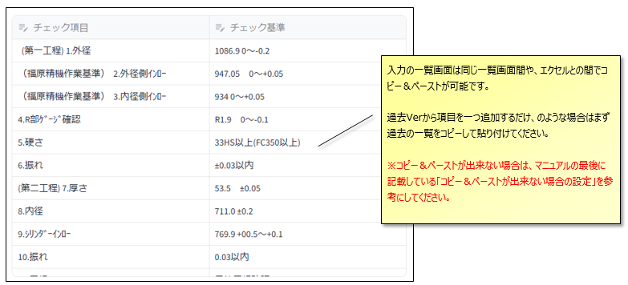  

#### 補足：チェック項目入力欄のコピー＆ペーストについて

一覧画面はコピー＆ペーストに対応しています。  
入力の省力化にご活用ください。  

 

画面間のコピー＆ペースト  
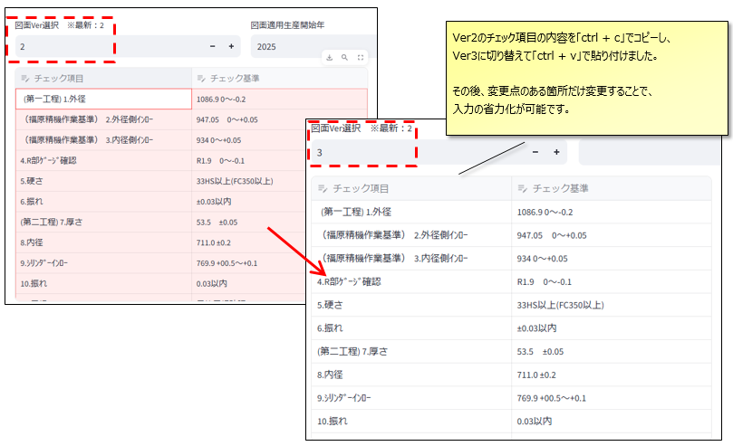  

 

エクセルからのコピー＆ペースト  
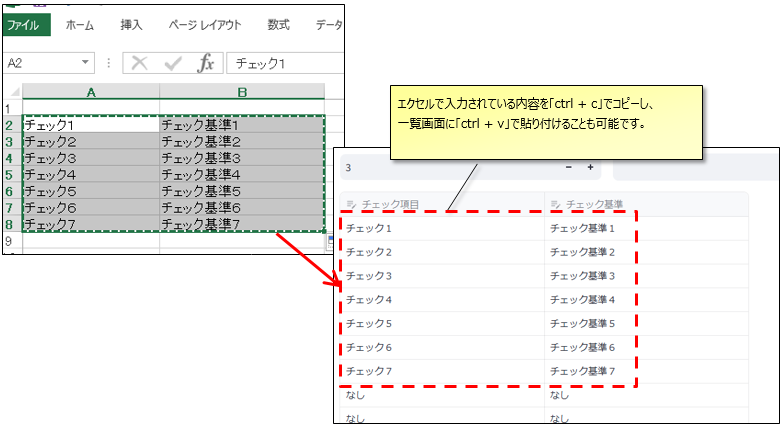  

### 更新ボタン

「チェック項目更新」ボタンを押下し、更新完了が表示されると完了です。  
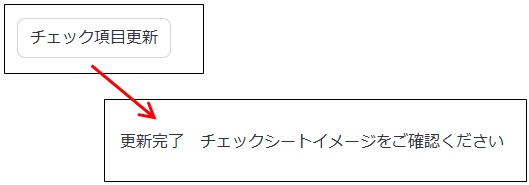  

---

## 画面３　チェックシートイメージの表示

**画面２　チェックシート項目　登録画面**で登録した内容を表示する画面です。  
 
この画面でデータの更新は出来ません。  
ここで表示されたチェックシートイメージは同様の内容がi-Reporterでも表示されます。登録後の確認のためにご活用ください。  
※表示される図面Verは常に最新のものとなります。  

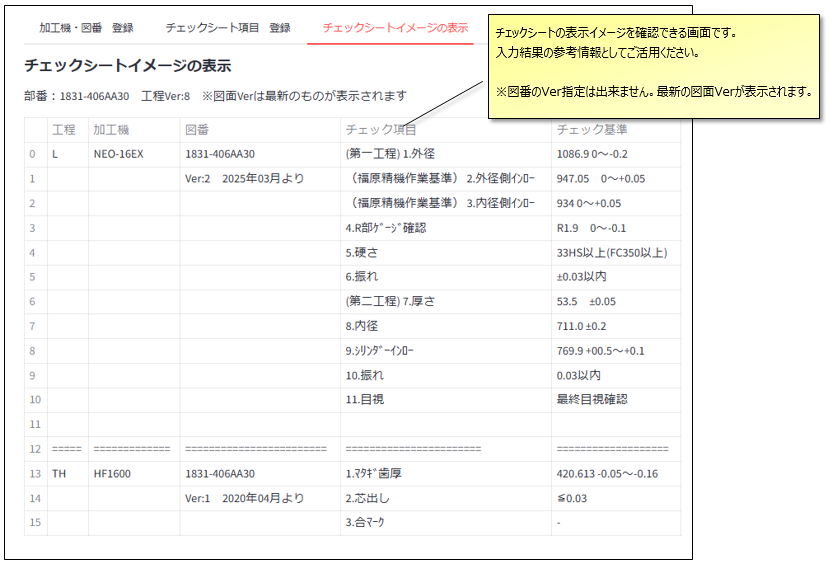  

 
表示されるチェックシートイメージは、「チェックシート項目　登録」画面で「図番選択」で選択された図番情報と紐づいた内容です。  

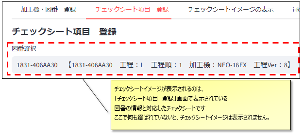  

---

## 画面４　i-Reporter発行対象管理

部品ごとに紐づいた入力項目と更新ボタンで構成されています。  

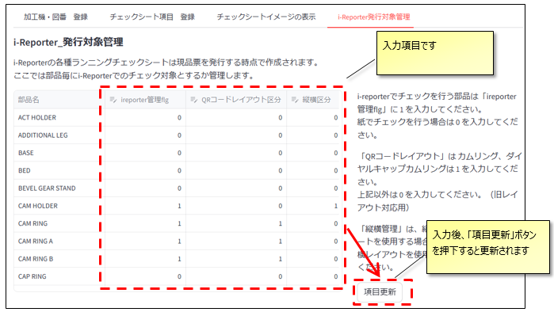

### 各種flgの入力項目

１．ireporter管理flg  
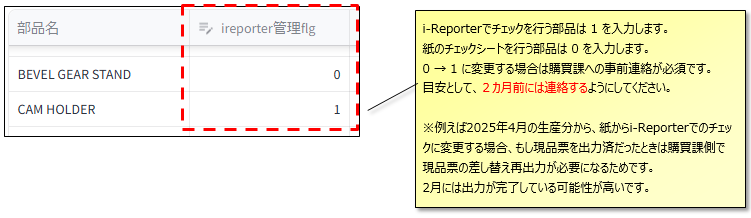  

 

２．QRコードレイアウト区分  
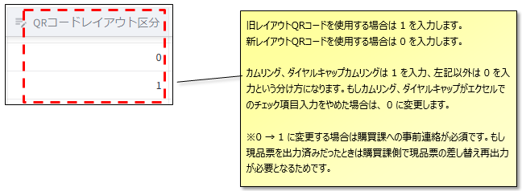  

３．縦横区分  
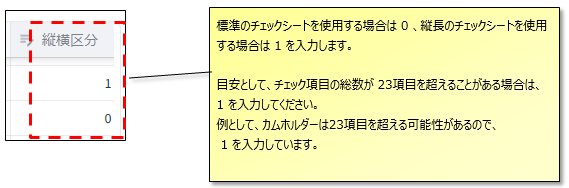  

### flgの更新ボタン

項目更新のボタンを押下すると、更新されます。  
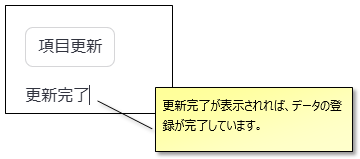  

## コピー＆ペーストが出来ない場合の設定

表内の項目のコピー＆ペーストが出来ない場合は、ブラウザの設定変更が必要となります。

・MicrosoftEdgeの場合  

１．画面上部のアドレスバーに Edge://flags と入力します  
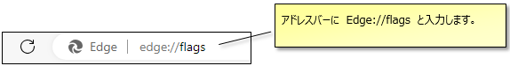  

 

２．flagsの設定画面が表示されるので、Search flags のと表示されている欄に、「Insecure origins treated as secure」と入力します。  
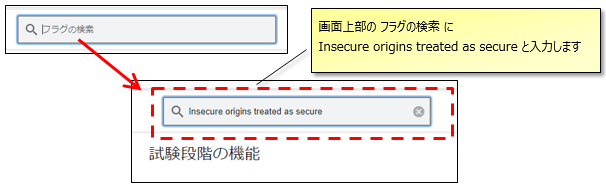  

 

３．入力欄が一つに絞られますので、「http://esrv10:8502」  
と入力して「有効」に変更します。  
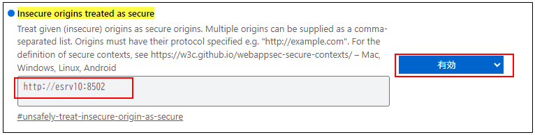  

 

４．ブラウザを再起動する（Edgeを全部×で落としてから、再度立ち上げる）と、コピー＆ペーストが可能になります。  
※パソコン自体の再起動は不要です。  

 

５．下図のメッセージが表示されるようになりますが、問題ありません。  
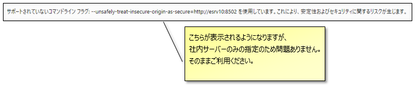  

 

・GoogleChromeの場合  

１．画面上部のアドレスバーに chrome://flags と入力します  
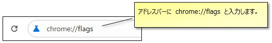  

 

２．flagsの設定画面が表示されるので、Search flags のと表示されている欄に、「Insecure origins treated as secure」と入力します。  
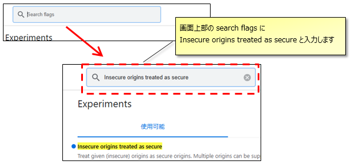  

 

３．入力欄が一つに絞られますので、「http://esrv10:8502」  
と入力して「有効」に変更します。  
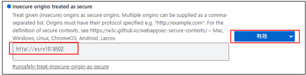  

 

４．ブラウザを再起動する（chromeを全部×で落としてから、再度立ち上げる）と、コピー＆ペーストが可能になります。  
※パソコン自体の再起動は不要です。  

 

５．下図のメッセージが表示されるようになりますが、問題ありません。  
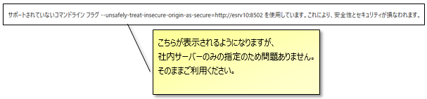  
