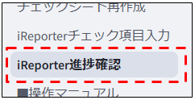
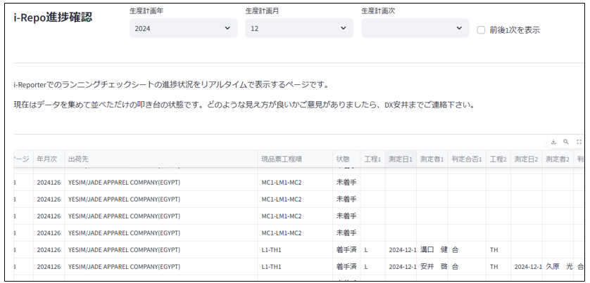

# iReporter進捗確認_操作マニュアル

当ドキュメントは、「iReporter進捗確認」画面の操作マニュアルです。

#### ※現在作成中です

  

---

## 画面概要

この画面は、i-Reporterでのランニングチェックシートの進捗状況をリアルタイムで確認するための画面です。  

データ取得の仕組みは完成しておりますが、現在はそのままデータを表示しているのみです。  
叩き台の状態ですので、ご意見等ありましたらDX安井までお気軽にご連絡ください。  

---

## 画面

  
