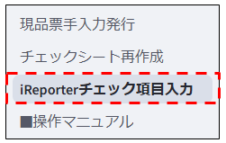

# i-Reporterチェック項目入力_操作マニュアル

当ドキュメントは、「i-Reporterチェック項目入力」画面の操作マニュアルです。  

  

---

## 画面概要

i-Reporterのランニングチェックシートで使用するチェック項目の登録を行う画面です。  
この画面から部番に繋がる図番と、図番のVersion毎のチェック内容を登録します。  

※誤更新防止のため、パスワード保護がかかっています。  

## 画面

※作成中
