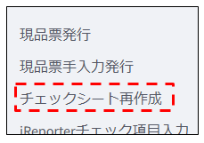
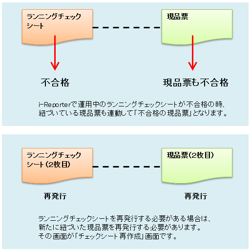
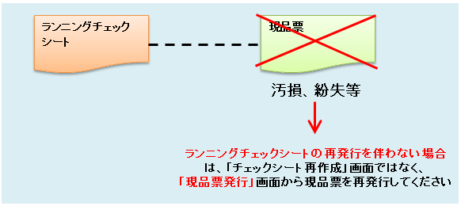
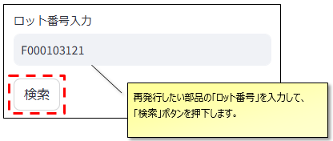
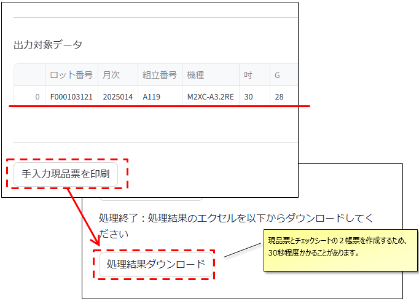

# チェックシート再作成_操作マニュアル

当ドキュメントは、「チェックシート再作成」画面の操作マニュアルです。

  

---

## 画面概要

この画面は、**i-Reporterのランニングチェックシート運用中の部品**について、。  
**チェック途中に不合格が出た、工破した等、同じロット番号で２枚目となるチェックシートを発行する場合**に使用します。

i-Reporterのチェックシート番号と現品票の発行番号が紐づいているため、  
チェックシートを再発行する場合は現品票も再発行する必要があります。  
  

  

※現品票が汚れたり破れた等で現品票を再発行したい場合は、通常の「現品票発行」画面より印刷してください。  
※i-Reporterではなく紙のチェックシートを使用している場合も、通常の「現品票発行」画面より印刷してください

  

---

## 画面・印刷

入力する項目は再発行するチェックシート（現品票）のロット番号のみです。  
ロット番号を入力して「検索」ボタンを押下してください。

  

  

再発行する対象データが表示されますので、間違いが無いかご確認ください。  

「手入力現品票を印刷」ボタンを押下すると、サーバーで現品票エクセルを作成します。  
30秒程度で「処理結果ダウンロード」のボタンが表示されますので、押下してダウンロードしてご利用ください。  

