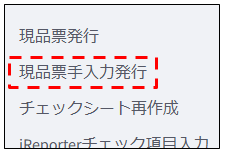
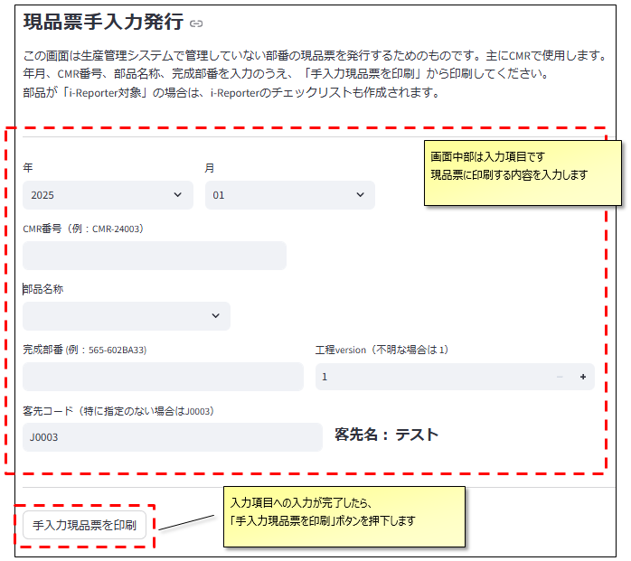
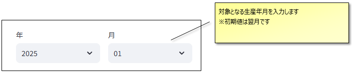
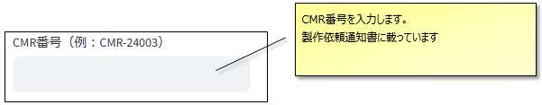
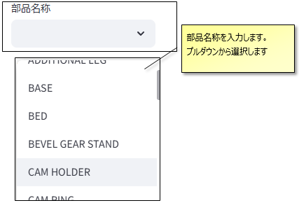
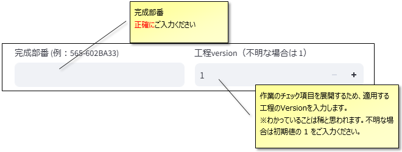
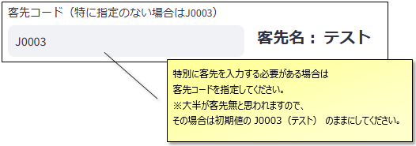
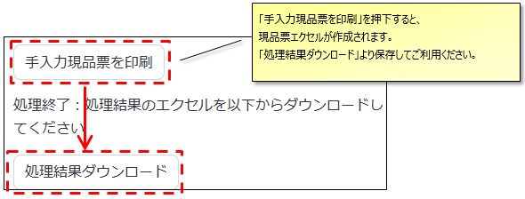

# 現品票手入力発行_操作マニュアル

当ドキュメントは、「現品票手入力発行」画面の操作マニュアルです。  

---

## 画面概要

生産管理システムで管理していない部番の現品票を発行するための画面です。  
主に**CMR機の現品票発行**に使用します。  
年月、CMR番号、部品名称、完成部番を入力のうえ、「手入力現品票を印刷」から印刷してください。  
※部品が「i-Reporter対象」の場合は、i-Reporterのチェックリストも作成されます。

---

## 画面

 

---

## 入力項目

項目の入力領域です。  
入力した内容が現品票に印刷されますので、正確にご入力ください。

### 生産年月

### CMR番号

### 部品名称

### 部番、工程Ver  

### 客先コード  

---

### 印刷

「手入力現品票を印刷」ボタンを押下すると、サーバーで現品票エクセルを作成します。  
１～２秒程度で「処理結果ダウンロード」のボタンが表示されますので、押下してダウンロードしてご利用ください。  

