# 現品票発行_操作マニュアル

当ドキュメントは、「現品票発行」画面の操作マニュアルです。  

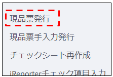

---

## 画面概要

新規現品票を発行するための画面です。  
http://ESRV10:8502/ にアクセスすることでどなたでもご利用いただけます。  
 
※現品票を汚損・紛失してしまった場合の再発行も当画面から行います。  

---

## 画面

- 上部で抽出条件を入力し一覧を絞り込む
- 中部で一覧から印刷対象を選択
- 下部で印刷処理を実行

 
上部

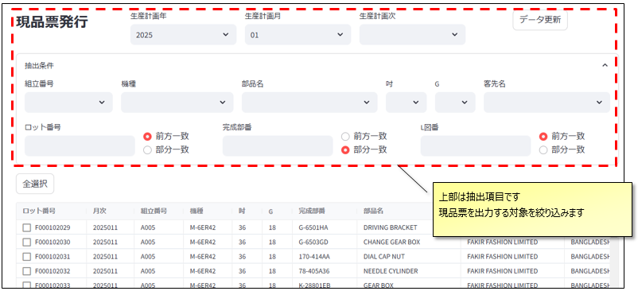

  
中部下部

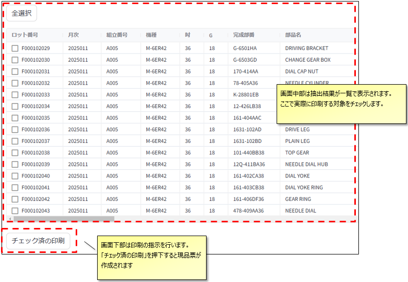

---

## 抽出項目

画面上部の各種抽出項目を選択・入力することで、画面中部の一覧に表示される内容を絞り込みます。

### 生産年月次

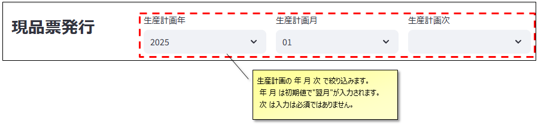

### より詳細な抽出条件

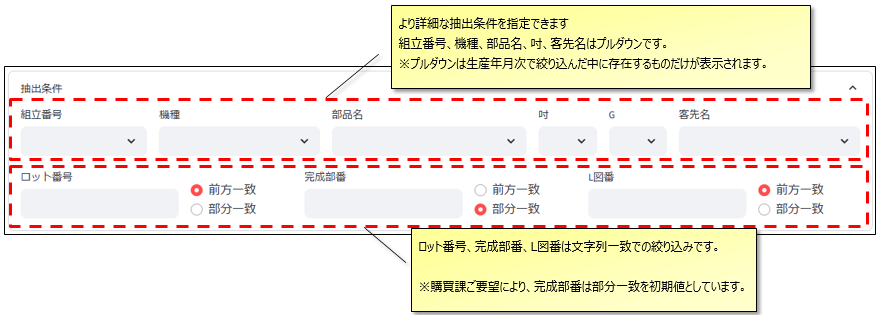

#### 補足１　抽出条件の折りたたみ

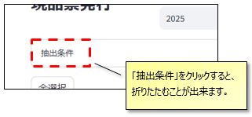

#### 補足２　データ更新ボタン

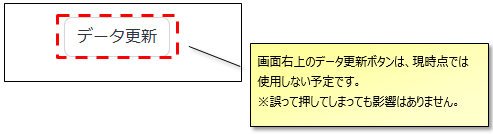

---

## 抽出結果と印刷対象のチェック

表示された一覧から、現品票を印刷する対象を選択します。

### 個別の選択

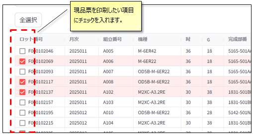  

 

### 全選択

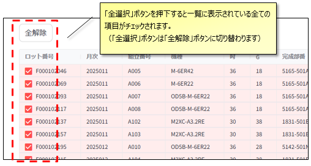  

#### 補足　一覧のソート

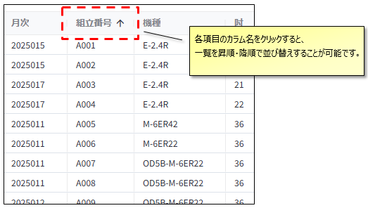

---

### 印刷

「チェック済を印刷」ボタンを押下すると、サーバーで現品票エクセルを作成します。  
お待ちいただくと「処理結果ダウンロード」のボタンが表示されますので、押下してダウンロードしてご利用ください。  

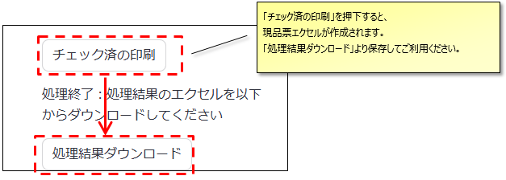

---

### 2025/4/10 CSV出力機能を追加しました

チェックした項目がcsvでダウンロード出来ますので、ご活用ください

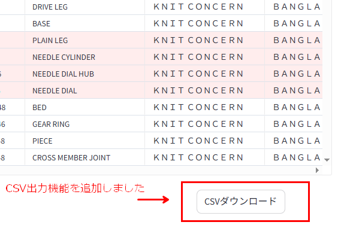

