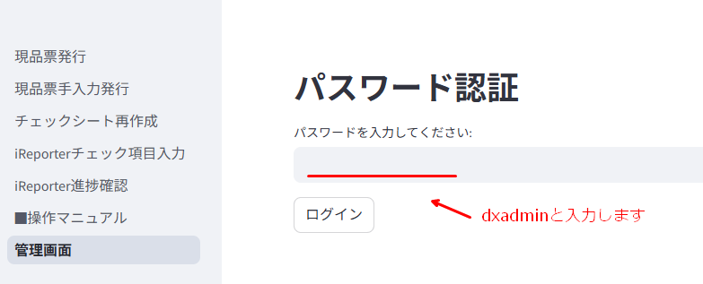
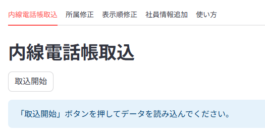
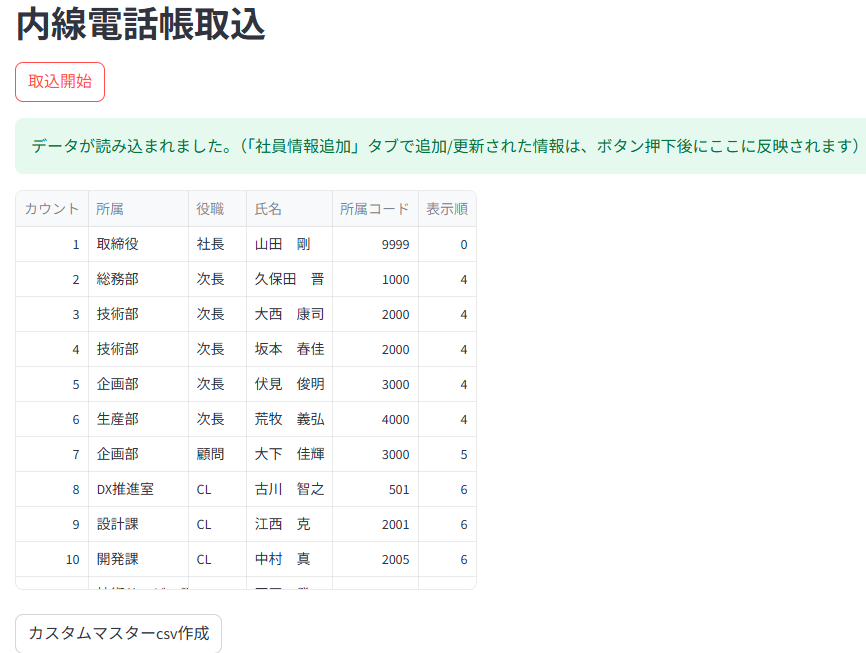
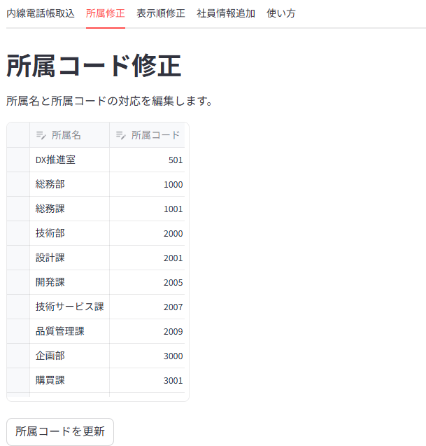
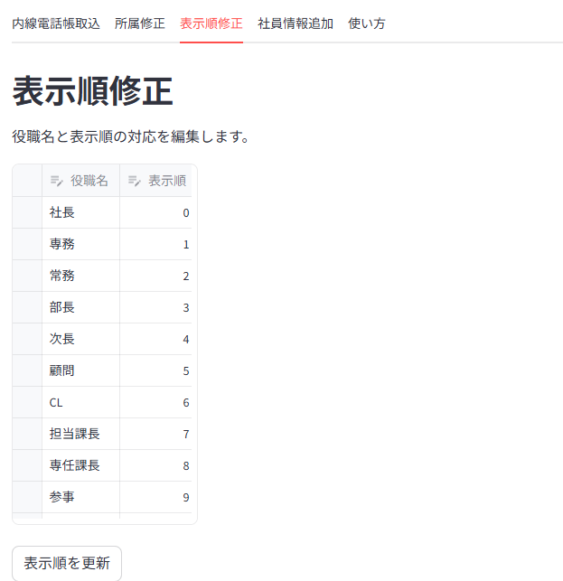
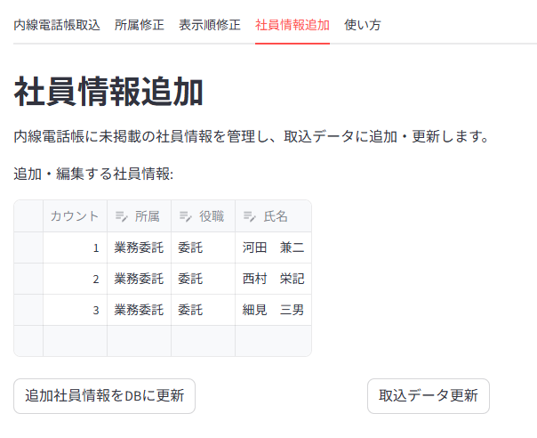

# 使い方

このマニュアルでは、当ツールの各機能の使い方について説明します。

## 0. 認証

管理画面は最初にパスワード認証画面が表示されます。

  

1.  「パスワードを入力してください:」というフィールドに、指定されたパスワード（デフォルト: `dxadmin`）を入力します。
2.  「ログイン」ボタンをクリックします。
3.  パスワードが正しければ、ツールのメイン画面が表示されます。間違っている場合はエラーメッセージが表示されます。

---

## 1. 内線電話帳取込タブ

このタブでは、指定されたExcelファイル（内線電話一覧表.xls）からデータを読み込み、整形して表示します。  
また、iReporterのカスタムマスター更新用のCSVファイルを作成する機能も提供します。  

#### 【重要】
内線電話一覧表.xlsのエクセルの記載ルールやレイアウトが変更になると、当ツールは正常に動かない可能性があります。  
そのため、「カスタムマスターcsv作成」ボタンを押下する前に、必ず一覧に抜け漏れが無いかを確認してください。  

  

### 機能概要

* Excelファイル（`.xls`形式）を読み込み、必要な情報を抽出・加工します。
* 加工されたデータを一覧表示します。
* 表示されたデータとiReporterの既存データを基に、カスタムマスター更新用のCSVファイルを作成できます。

### 操作手順

1.  **データ取込:**
    * 「取込開始」ボタンをクリックします。
    * 処理が開始され、完了すると読み込まれたデータが画面下部に一覧表示されます。
    * エラーが発生した場合は、エラーメッセージが表示されます。
    * 一覧には、「カウント」「所属」「役職」「氏名」「所属コード」「表示順」の列が表示されます。
      

     

    #### 【重要】
    * 内線電話帳に載っていない社員を取込む場合は、[社員情報追加]タブより、「取込データ更新」ボタンを押下して下さい。
    * 「社員情報追加」タブで追加・更新された情報がある行は、背景色が**黄色でハイライト表示**されます。

2.  **カスタムマスターCSV作成:**
    * データ取込後、「カスタムマスターcsv作成」ボタンが表示されます。
    * このボタンをクリックすると、社員マスタのCSVファイルがサーバーで作成されます
    * 「カスタムマスター更新用csvを作成しました」というメッセージが表示されれば作成成功です。

### 表示される情報（データ取込後）

* **カウント:** 連番
* **所属:** 社員の所属部署名
* **役職:** 社員の役職名
* **氏名:** 社員の氏名
* **所属コード:** 所属に対応するコード（「所属修正」タブで設定）
* **表示順:** 役職に応じた表示優先度（「表示順修正」タブで設定）

---

## 2. 所属修正タブ

このタブでは、内線電話帳データ内の「所属」と、それに対応する「所属コード」を編集・管理します。  
ここで設定したマッピングは、「内線電話帳取込」タブでデータ処理を行う際に使用されます。

  

### 機能概要

* 「所属名」と「所属コード」の対応リストを表示・編集できます。
* 新しい所属とコードのペアを追加したり、既存のペアを修正・削除したりできます。
* 変更内容はデータベースに保存され、次回以降のデータ取込処理に反映されます。

### 操作手順

1.  **表示と確認:**
    * タブを開くと、現在データベースに登録されている所属名と所属コードの一覧が、所属コードの昇順で表示されます。

2.  **編集:**
    * **既存データの修正:** 表示されている所属名または所属コードのセルをダブルクリックすると編集モードになります。値を変更し、Enterキーを押すか他のセルをクリックすると変更が一時的に適用されます。
    * **新規データの追加:** 表の最終行の下にある「+」アイコン（または最終行でEnterキー）を押すと新しい行が追加されます。「所属名」と「所属コード」を入力してください。
    * **データの削除:** 削除したい行の左端にあるチェックボックスを選択し、表の上部に表示されるゴミ箱アイコンをクリックします。

3.  **更新の保存:**
    * 編集後、「所属コードを更新」ボタンをクリックします。
    * 入力内容に問題（空欄、重複など）がなければ、変更がデータベースに保存され、「所属コードマッピングを更新しました。」というメッセージが表示され、画面がリロードされます。
    * エラーがある場合は、エラーメッセージが表示されます。

### 入力項目と注意点

* **所属名:** 必須項目です。空欄にしたり、他の所属名と重複させたりすることはできません。
* **所属コード:** 必須項目です。数値で入力してください。空欄にしたり、他の所属コードと重複させたりすることはできません。

---

## 3. 表示順修正タブ

このタブでは、内線電話帳データ内の「役職」と、それに対応する「表示順」を編集・管理します。  
表示順は数値が小さいほど優先して表示されます。ここで設定したマッピングは、「内線電話帳取込」タブでデータ処理を行う際に使用されます。

  

### 機能概要

* 「役職名」と「表示順」の対応リストを表示・編集できます。
* 新しい役職と表示順のペアを追加したり、既存のペアを修正・削除したりできます。
* 変更内容はデータベースに保存され、次回以降のデータ取込処理に反映されます。

### 操作手順

1.  **表示と確認:**
    * タブを開くと、現在データベースに登録されている役職名と表示順の一覧が、表示順の昇順で表示されます。

2.  **編集:**
    * **既存データの修正:** 表示されている役職名または表示順のセルをダブルクリックすると編集モードになります。値を変更し、Enterキーを押すか他のセルをクリックすると変更が一時的に適用されます。
    * **新規データの追加:** 表の最終行の下にある「+」アイコン（または最終行でEnterキー）を押すと新しい行が追加されます。「役職名」と「表示順」を入力してください。
    * **データの削除:** 削除したい行の左端にあるチェックボックスを選択し、表の上部に表示されるゴミ箱アイコンをクリックします。

3.  **更新の保存:**
    * 編集後、「表示順を更新」ボタンをクリックします。
    * 入力内容に問題（空欄、重複など）がなければ、変更がデータベースに保存され、「表示順マッピングを更新しました。」というメッセージが表示され、画面がリロードされます。
    * エラーがある場合は、エラーメッセージが表示されます。

### 入力項目と注意点

* **役職名:** 必須項目です。空欄にしたり、他の役職名と重複させたりすることはできません。Excelデータ内の役職名と完全に一致するように設定してください。役職が空欄の場合や、このマッピングに存在しない役職の場合は、「一般」として扱われます。
* **表示順:** 必須項目です。数値で入力してください。空欄にしたり、他の表示順と重複させたりすることはできません。

---

## 4. 社員情報追加タブ

このタブでは、元のExcelファイル（内線電話一覧表）に掲載されていない社員の情報を手動で追加・編集し、データベースに保存します。  
ここで登録した情報は、「内線電話帳取込」タブのデータに統合（追加または更新）することができます。

  

### 機能概要

* 内線電話帳に未掲載の社員情報を「所属」「役職」「氏名」の形式で登録・管理できます。
* 登録された社員情報は、データベースに保存されます。
* 「取込データ更新」ボタンを押すことで、「内線電話帳取込」タブで読み込まれたデータに対して、ここで登録した社員情報を反映させることができます。
    * 同じ氏名の社員が取込データに存在する場合：その社員の所属、役職、所属コード、表示順を更新します。
    * 同じ氏名の社員が取込データに存在しない場合：新しい社員情報として追加します。

### 操作手順

1.  **表示と確認:**
    * タブを開くと、現在データベースに登録されている追加社員情報の一覧が表示されます。
    * 「所属」と「役職」は、「所属修正」タブと「表示順修正」タブで設定されたマッピングに基づいたプルダウンリストから選択できます。

2.  **編集:**
    * **既存データの修正:** 表示されている所属、役職、氏名のセルをダブルクリック（または選択してEnter）すると編集モードになります。値を変更し、Enterキーを押すか他のセルをクリックすると変更が一時的に適用されます。
    * **新規データの追加:** 表の最終行の下にある「+」アイコン（または最終行でEnterキー）を押すと新しい行が追加されます。「所属」「役職」「氏名」を入力・選択してください。
    * **データの削除:** 削除したい行の左端にあるチェックボックスを選択し、表の上部に表示されるゴミ箱アイコンをクリックします。

3.  **追加社員情報のDB更新:**
    * 編集後、「追加社員情報をDBに更新」ボタンをクリックします。
    * 入力内容に問題（空欄、氏名の重複など）がなければ、変更がデータベースに保存され、「追加社員情報をデータベースに更新しました。」というメッセージが表示され、画面がリロードされます。
    * エラーがある場合は、エラーメッセージが表示されます。

4.  **取込データへの反映:**
    * まず「内線電話帳取込」タブでデータを読み込んでいる必要があります。
    * データベースに保存されている最新の追加社員情報で、取込タブのデータを更新したい場合、「取込データ更新」ボタンをクリックします。
    * 処理が完了すると、更新・追加された件数とともに成功メッセージが表示されます。
    * この操作後、「内線電話帳取込」タブに戻ると、反映されたデータ（変更・追加された行は黄色でハイライト）を確認できます。

### 入力項目と注意点

* **カウント:** 自動で振られる連番です。編集できません。
* **所属:** プルダウンから選択します。必須項目です。プルダウンの選択肢は「所属修正」タブの内容に基づきます。
* **役職:** プルダウンから選択します。必須項目です。プルダウンの選択肢は「表示順修正」タブの内容に基づきます。
* **氏名:** テキスト入力します。必須項目です。他の氏名と重複させることはできません。

---